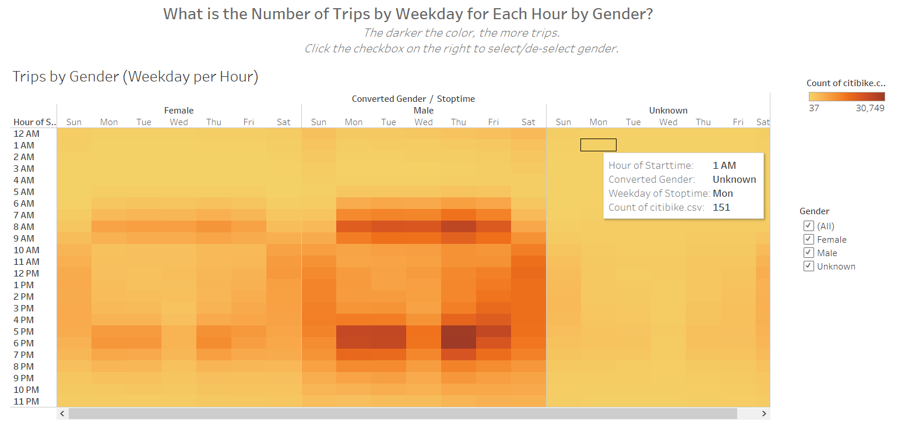
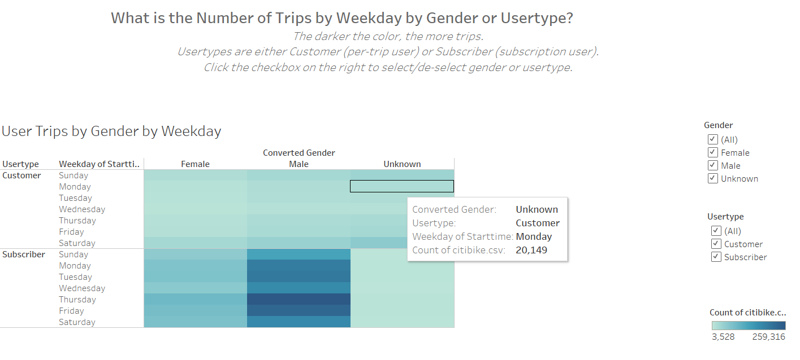

# Bikesharing

## Overview
#### What is this about?

The purpose of this analysis is to convince investors that a bike-sharing business in Des Moines is a good idea.  I am doing this by showing various visualizations of bike-sharing data in New York City that was taken in August 2019.

## Results
#### What are the results?

Here are the various story pages I presented in an attempt to answer 6 questions:

- Who uses the bike-sharing program? 

  - There were over 2 million trips in one month. 

  - More than 3/4 of the users were subscribers, and less than 1/4 were customers.
  
  - About 3/4 of the users were male and 1/4 female.
  
      
  
- What is the number of bikes per hour of trip duration?

  - The most number of bikes are checked out between 5 and 6am.
	- Actual trip duration varies.
	-   

- What is the number of bikes per hour of trip duration by gender?

  - For males, the highest number of bikes were checked out between 5 and 6am.
  - For females, the highest number of bikes were checked out between 5 and 7am.
  - For both females and unknown, usage is much more flat than the male usage.

  

  

- What is the number of trips by weekday for each hour?
  
  - The largest number of trips are done Thursday evenings between 5 and 7pm. 
  
  
    
  

​	
- What is the number of trips by weekday for each hour by gender?
	
	- For males and females, checkout is highest on Thursday afternoons between 5 and 7pm.
		
	- For males and females, the second highest checkout time is around 8am on weekdays. 
		
	- For unknowns, the highest usage time is on weekends.
		
		
		   
	
- What is the number of trips by weekday by gender or usertype?

  - Male subscribers have the highest number of trips by far over female subscribers.
  - Male and female customers (per-trip users) do not vary greatly; their numbers are close.

     

## Summary
#### What are the conclusions and suggestions for future analysis?

To summarize:

- Bikes are used most often by males.
- Bikes are used most often during commute hours, especially evenings. The busiest time of the week is Thursday evenings.
- When reviewing the subscriber model, males showed far more usage than females.
- When reviewing the customer (per-use) model, males and females showed similar usage.

Here are some additional visualizations that could be made using the same data set:

- The number of trips per day for the genders and usertypes.
- Number of trips by user's birth year.
- Using a calculation based on latitude and longitude, calculate the average distance per trip.

The link to my public Tableau dashboard is here: 

https://public.tableau.com/profile/amy.tieku#!/vizhome/Module14Challenge2/Bike-SharingAnalysis?publish=yes

  
