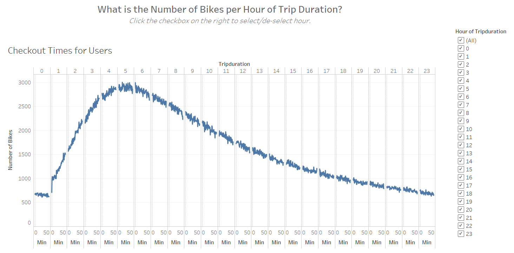

# Bikesharing

## Overview

Make a sub-heading

The purpose of this analysis is to convince investors that a bike-sharing business in Des Moines is a good idea.  We are doing this by showing various visualizations of bike-sharing data in New York City that was taken in August 2019.

## Results

make a sub-heading - there needs to be 7 and there needs to be a description and results for each and embed the Tableau link

Here are the various story pages I presented:

- Who uses the bike-sharing program? 

  - There were over 2 million trips in one month. More than 3/4 of them were subscribers, and less than 1/4 were per-trip users.

      
  
- What is the utilization of the bike-sharing program?
  
- Most of the utilization is made during the morning and evening rush-hours, and on weekends.
	

    
  
- What time of day are bikes checked out?

  - 	Bikes are checked out most often during morning and evening rush hours, and on weekends.
  	   

- What time of day are bikes checked out by gender?
	
	- Bikes are checked out by gender....   
	
- What are the trips by gender (weekday per hour)?
	
	- The same pattern exists for both genders which is checkout during morning and evening rush-hours, and on weekends. 
		   
	
- What are the user trips by gender by weekday?

  - Males have the most user trips by 

- 	text
   

## Summary

make a sub-heading - high level summary and 2 additional visualizations are suggested for future analysis

The link to my public Tableau story is here: 

https://public.tableau.com/profile/amy.tieku#!/vizhome/Module14Challenge2/Bike-SharingAnalysis

To summarize, bikes are used most often:

- By males
- During rush-hours and on weekends

Here are some additional visualizations that could be made using the same data set:

- How many trips per day are being made by gender.
- Breakdown of customers vs subscribers by gender.

  
